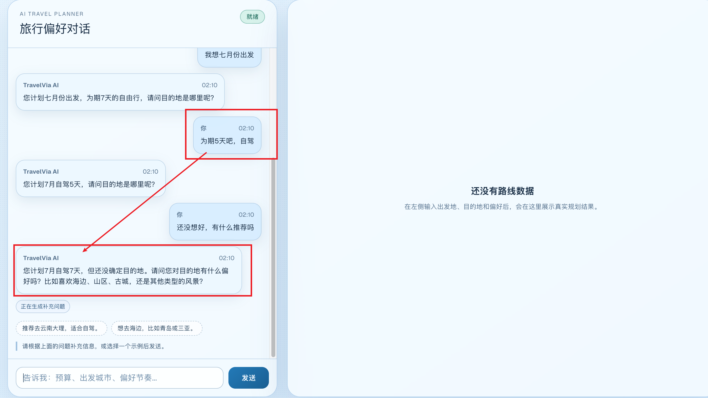

# WEB

- web 会展示出 issues 信息（data.errors）
- web graph 节点显示信息要做优化
  - 描述优化
  - 节点 event=done 时，描述信息错误
- web 界面优化
  - [✅] 使用 gpt-image2 生成设计稿，codex 实现
  - 会话（规划）历史
- 景点推荐图片
  - 多张要轮播
  - 点击单张要能放大查看
- 酒店图片错误，使用的是景点推荐第一张图片
- 天气要增加小图标

# APIS & AGENTS

- agents 要支持连续对话（记忆）
- apis 在总结阶段吐出的 token 没有按照预设方式吐出（预设方式是段落式的，实际还是单个token吐）
- apis 增加 sqlit 数据库做
  - 对话历史（必要的，因为现在没有历史记录，接着聊天会导致上下文看不到有疑问）
  - 规划历史

- 针对 amap 请求失败，要做 3 次重试机制：Amap api error: 'This operation was aborted'
- essentialItems 格式要改：
  ```typescript
    interface essentialItems: {
      name: string,
      icon: keyof Lucide-React
    }
  ```